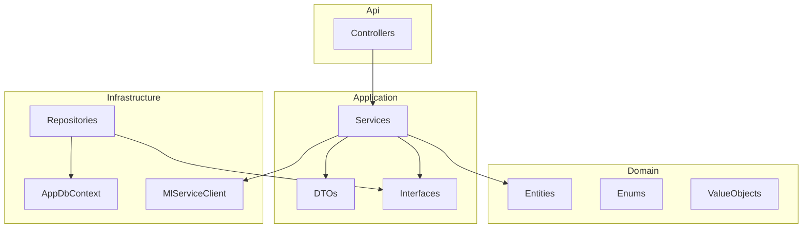

# Backend Mimarisi

## Clean Architecture Katmanları



## Proje Yapısı

```
backend/src/
├── EduAnalyzer.Api/          # Web API, Controllers, Auth middleware
├── EduAnalyzer.Application/  # Services, DTOs, IRepository interfaces
├── EduAnalyzer.Domain/       # Entities (User, Teacher, Student, Exam, ExamResult, ...)
└── EduAnalyzer.Infrastructure/ # EF Core, Repositories, MlServiceClient
```

## API Özeti

| Endpoint | Açıklama |
|----------|----------|
| `POST /api/auth/login` | Giriş (JWT döner) |
| `GET /api/health` | Sağlık kontrolü (ML dahil) |
| `GET /api/me/results` | Öğrenci: kendi sınav sonuçları |
| `GET /api/me/children` | Veli: bağlı öğrenciler + sonuçlar |
| `GET /api/students` | Öğrenci listesi |
| `GET /api/students/{id}/results` | Öğrenci sınav sonuçları |
| `GET /api/classes` | Sınıf listesi |
| `GET /api/exams` | Sınav listesi |
| `PUT /api/exams/{id}/answer-key` | Cevap anahtarını kaydet |
| `POST /api/exams/{id}/results/scan` | Optik tarama sonucu |
| `POST /api/exams/results` | Sınav sonucu ekle |
| `GET /api/analyses` | Analiz geçmişi |
| `POST /api/analyses/pdf` | PDF yükle → ML analizi → kayıt |

## Test Çalıştırma

```bash
cd backend
dotnet test
```
