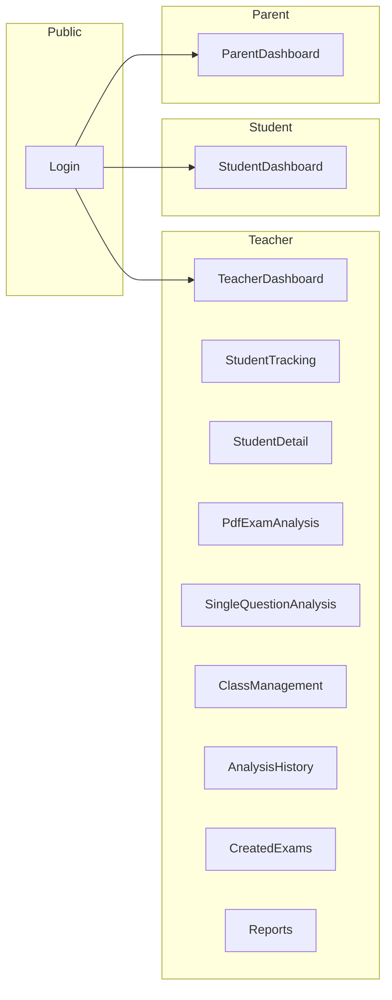

# Frontend Mimarisi

## Sayfa Yapısı

## Routing

| Rota | Rol | Açıklama |
|------|-----|----------|
| `/login` | - | Giriş sayfası |
| `/dashboard` | Teacher | Öğretmen ana panel |
| `/dashboard/ogrenci-takibi` | Teacher | Öğrenci listesi |
| `/dashboard/ogrenci/:id` | Teacher | Öğrenci detayı |
| `/dashboard/sinav-analizi` | Teacher | PDF analizi |
| `/dashboard/tek-soru` | Teacher | Tek soru tahmin |
| `/dashboard/siniflar` | Teacher | Sınıf yönetimi |
| `/dashboard/analiz-gecmisi` | Teacher | Analiz geçmişi |
| `/dashboard/olusturulan-sinavlar` | Teacher | Oluşturulan sınavlar |
| `/dashboard/raporlar` | Teacher | Raporlar |
| `/student` | Student | Öğrenci paneli |
| `/parent` | Parent | Veli paneli |

## Context'ler

- **AuthContext:** `user`, `isAuthenticated`, `login`, `logout`, `loginDemo`, `loginDemoParent`
- **TeacherDataContext:** `students`, `classes`, `analyses`, `exams`, `examResults`, `loading`, `refresh`, CRUD fonksiyonları

## Koruma

- **ProtectedRoute:** Giriş yapılmamışsa `/login` yönlendirir
- **RoleProtectedRoute:** Rol uyumsuzsa Teacher→`/dashboard`, Student→`/student`, Parent→`/parent` yönlendirir

## Stil

- Bootstrap 5 + Metronic tema
- Dark/Light tema desteği
- KTIcon (Bootstrap Icons)
