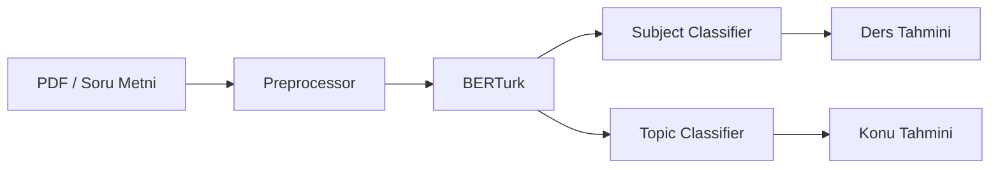

# ML Servisi Mimarisi

## Model Pipeline

## Bileşenler

| Modül | Açıklama |
|-------|----------|
| `api/routes/predict.py` | Tek soru tahmin endpoint'i |
| `api/routes/pdf_upload.py` | PDF yükleme ve toplu analiz |
| `models/classifier.py` | Ders + Konu sınıflandırıcı |
| `data/dataset.py` | Veri seti yükleme |
| `data/preprocessor.py` | Metin ön işleme |

## Veri Seti

- `question_dataset.json` / `question_training_dataset.json`
- Ders ve konu etiketleri
- Eğitim: `scripts/retrain_and_evaluate.sh`

## Eğitim Döngüsü

1. Veri temizliği (karışım raporlarına göre)
2. `retrain_and_evaluate.sh` çalıştır
3. `topic_confusions.json` ile karışımları incele
4. Gerekirse örnek düzelt, tekrar eğit

## API Endpoint'leri

| Endpoint | Açıklama |
|----------|----------|
| `POST /predict` | Tek soru metni → ders + konu tahmini |
| `POST /analyze-pdf` | PDF dosyası → tüm soruların tahminleri |
| `GET /health` | Servis sağlık kontrolü |

## İyileştirme Rehberi

Detaylı bilgi için: [ml-service/eval/ML_IMPROVEMENT_GUIDE.md](../../ml-service/eval/ML_IMPROVEMENT_GUIDE.md)
