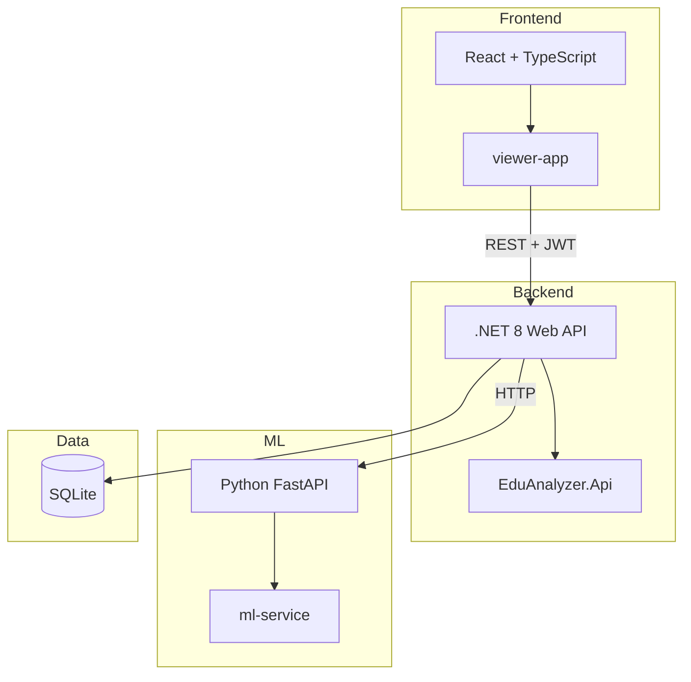

# EduAnalyzer - Mimari Genel Bakış

EduAnalyzer, MEB 8. Sınıf Türkçe sınav sorularının ders ve konu tahminini yapan, öğretmen/öğrenci/veli rolleriyle çalışan bir eğitim analiz platformudur.

## Bileşenler

## Veri Akışı

1. **Öğretmen:** PDF yükler → Backend PDF'i ML servisine gönderir → ML ders/konu tahminleri döner → Backend analiz kaydı oluşturur → Frontend listeler
2. **Öğrenci:** Kendi sınav sonuçlarını görüntüler (Backend `/api/me/results`)
3. **Veli:** Bağlı öğrencilerin sonuçlarını görüntüler (Backend `/api/me/children`)

## Teknoloji Özeti

| Katman | Teknoloji |
|--------|-----------|
| Frontend | React 18, TypeScript, Vite, Bootstrap, Metronic |
| Backend | .NET 8, EF Core, SQLite, JWT |
| ML | Python, FastAPI, BERTurk, PyTorch |

## Detaylı Dokümantasyon

- [Backend Mimarisi](backend.md)
- [Frontend Mimarisi](frontend.md)
- [ML Servisi](ml.md)
