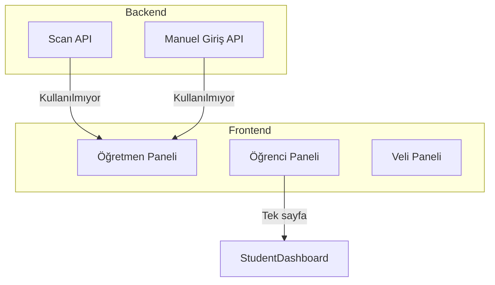
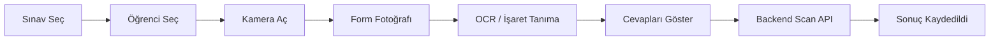
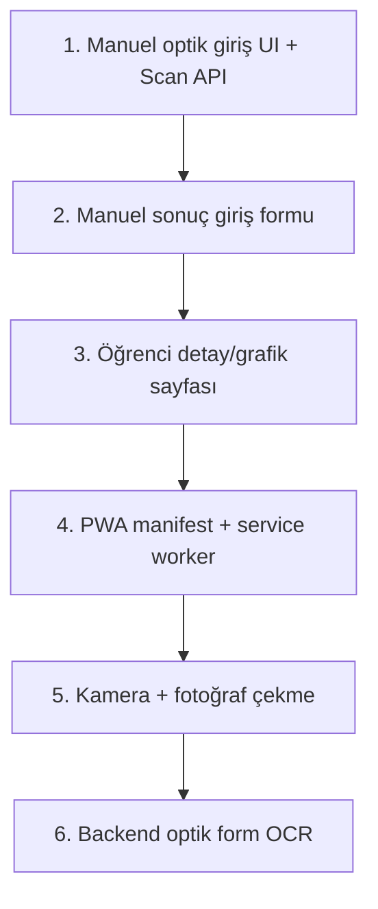

# EduAnalyzer - Eksikler ve Yapılması Gerekenler Raporu

## Mevcut Durum Özeti

---

## 1. Öğrenci Mobil UI Eksikleri

### Mevcut Durum

- **Tek sayfa:** [StudentDashboard.tsx](viewer-app/src/pages/StudentDashboard.tsx) - sadece sınav sonuçları listesi
- **Layout:** [StudentLayout.tsx](viewer-app/src/components/layout/StudentLayout.tsx) - `d-none d-sm-inline` ile mobilde kullanıcı adı gizleniyor
- **Viewport:** `index.html` içinde mevcut

### Eksikler

| Eksik                 | Açıklama                                                                                                                                                                | Öncelik |
| --------------------- | ----------------------------------------------------------------------------------------------------------------------------------------------------------------------- | ------- |
| Öğrenci detay sayfası | Kendi sonuç detayı, konu bazlı grafik, haftalık trend yok                                                                                                               | Yüksek  |
| Mobil-first tasarım   | Bootstrap responsive var ama öğrenci paneli mobil için optimize değil                                                                                                   | Orta    |
| PWA / Mobil uygulama  | `manifest.json`, service worker yok; "öğrenci mobil uygulamasında kullanılabilir" ([AnalysisDetail.tsx:365](viewer-app/src/pages/AnalysisDetail.tsx)) metni placeholder | Yüksek  |
| Offline desteği       | Service worker yok, offline çalışma yok                                                                                                                                 | Düşük   |
| Touch UX              | Mobil dokunmatik için özel iyileştirmeler yok                                                                                                                           | Orta    |

### Önerilen Yapılacaklar

1. **Öğrenci sonuç detay sayfası:** `/student/sonuc/:id` - tek sınav sonucu, yanlış sorular, konu dağılımı
2. **Öğrenci grafik sayfası:** Haftalık gelişim grafiği (StudentDetail benzeri, kendi verisi)
3. **PWA:** `vite-plugin-pwa` ile manifest + service worker
4. **Mobil layout:** Öğrenci panelinde bottom navigation veya mobil menü

---

## 2. Optik Okuma ve Kamera Entegrasyonu

### Backend - Hazır

- **Endpoint:** `POST /api/exams/{id}/results/scan` ([ExamsController.cs:57-62](backend/src/EduAnalyzer.Api/Controllers/ExamsController.cs))
- **Request:** `ScanExamRequest(StudentId, StudentAnswers[])` - öğrenci ID + A/B/C/D/E cevap dizisi
- **İşlem:** Cevap anahtarıyla karşılaştırma, doğru/yanlış, konu bazlı hata, `source: "optical"` kayıt

### Frontend - Tamamen Eksik

| Eksik               | Açıklama                                                                          | Öncelik |
| ------------------- | --------------------------------------------------------------------------------- | ------- |
| Scan API client     | [backendApi.ts](viewer-app/src/services/backendApi.ts) içinde `examsApi.scan` yok | Yüksek  |
| Optik tarama UI     | Sınav seç → Öğrenci seç → Cevap girişi (manuel veya kamera) ekranı yok            | Yüksek  |
| Kamera entegrasyonu | `getUserMedia`, optik form fotoğrafı çekme, işleme yok                            | Yüksek  |
| Optik form OCR      | Fotoğraftan işaretleri (A/B/C/D/E) otomatik okuma yok                             | Yüksek  |

### Kamera + Optik Okuma Akışı (Yapılacak)

### Teknik Seçenekler

1. **Web API:** `navigator.mediaDevices.getUserMedia` ile kamera erişimi
2. **Optik form tanıma:**
  - **Seçenek A:** Canvas + görüntü işleme (OpenCV.js, TensorFlow.js) - karmaşık
  - **Seçenek B:** Backend'e fotoğraf gönder, Python (OpenCV, EasyOCR) ile işle - daha gerçekçi
  - **Seçenek C:** Önce manuel giriş UI, kamera/OCR sonra - aşamalı

### Önerilen Sıra

1. **Manuel optik giriş UI:** Sınav + öğrenci seç, 20 soruluk A/B/C/D/E grid, Scan API çağrısı
2. **Kamera:** Fotoğraf çek, backend'e gönder (yeni endpoint gerekir)
3. **Backend OCR:** Python/OpenCV ile optik form işaret tanıma (ayrı servis veya ml-service eklentisi)

---

## 3. Manuel Sınav Sonucu Girişi

### Mevcut Durum

- **Backend:** `POST /api/exams/results` ([ExamsController.cs:64-68](backend/src/EduAnalyzer.Api/Controllers/ExamsController.cs)) - `CreateExamResultRequest`
- **Frontend:** [TeacherDataContext](viewer-app/src/contexts/TeacherDataContext.tsx) `addExamResult` → `examsApi.addResult` tanımlı
- **UI:** Hiçbir sayfada `addExamResult` çağrılmıyor; manuel giriş formu yok

### Eksik

- Oluşturulan sınavlar veya analiz detay sayfasında "Sonuç Ekle" butonu
- Form: Öğrenci seç, doğru/yanlış sayısı, zayıf konular (opsiyonel)

### Önerilen Yer

- [CreatedExams.tsx](viewer-app/src/pages/CreatedExams.tsx): Her sınav satırında "Sonuç Ekle" veya
- [AnalysisDetail.tsx](viewer-app/src/pages/AnalysisDetail.tsx): Sınav hazır olduktan sonra "Sonuç Girişi" bölümü

---

## 4. PWA ve Mobil Altyapı

| Eksik          | Durum | Öneri                         |
| -------------- | ----- | ----------------------------- |
| manifest.json  | Yok   | `vite-plugin-pwa` ile oluştur |
| Service worker | Yok   | Workbox ile cache stratejisi  |
| App ikonu      | Yok   | 192x192, 512x512 PNG          |
| Install prompt | Yok   | "Uygulamayı yükle" banner     |

---

## 5. Diğer Eksikler

| Konu                                                            | Durum                                                                                    | Not                                                 |
| --------------------------------------------------------------- | ---------------------------------------------------------------------------------------- | --------------------------------------------------- |
| Veli paneli mobil                                               | Responsive var, özel mobil UX yok                                                        | Student ile benzer                                  |
| [StudentDetail.tsx:235](viewer-app/src/pages/StudentDetail.tsx) | "Optik okuma sonuçları burada görünecektir"                                              | Bilgilendirme metni - optik UI eklendiğinde anlamlı |
| pdf_extractor OCR                                               | [VISUAL_OCR_README.md](pdf_extractor/VISUAL_OCR_README.md) - EasyOCR PDF görselleri için | Optik form işaret tanıma farklı - ayrı modül        |

---

## Öncelik Sıralaması

| Sıra | Özellik                                          | Tahmini Süre |
| ---- | ------------------------------------------------ | ------------ |
| 1    | Optik tarama UI (manuel cevap girişi + Scan API) | 4-6 saat     |
| 2    | Manuel sonuç giriş formu                         | 2-3 saat     |
| 3    | Öğrenci sonuç detay + grafik sayfası             | 3-4 saat     |
| 4    | PWA (manifest, service worker, ikon)             | 2-3 saat     |
| 5    | Kamera entegrasyonu (fotoğraf çek, göster)       | 2-3 saat     |
| 6    | Backend optik form OCR (fotoğraf → cevaplar)     | 8-12 saat    |

---

## Dosya Referansları

| Konu              | Dosya                                                                                                                                                           |
| ----------------- | --------------------------------------------------------------------------------------------------------------------------------------------------------------- |
| Scan API          | [ExamsController.cs](backend/src/EduAnalyzer.Api/Controllers/ExamsController.cs), [ExamService.cs](backend/src/EduAnalyzer.Application/Services/ExamService.cs) |
| DTO               | [ExamDtos.cs](backend/src/EduAnalyzer.Application/DTOs/ExamDtos.cs) - ScanExamRequest, ScanExamResponse                                                         |
| API client        | [backendApi.ts](viewer-app/src/services/backendApi.ts) - examsApi (scan eksik)                                                                                  |
| Öğrenci UI        | [StudentDashboard.tsx](viewer-app/src/pages/StudentDashboard.tsx), [StudentLayout.tsx](viewer-app/src/components/layout/StudentLayout.tsx)                      |
| Placeholder metin | [AnalysisDetail.tsx:365](viewer-app/src/pages/AnalysisDetail.tsx), [CreatedExams.tsx:25](viewer-app/src/pages/CreatedExams.tsx)                                 |

