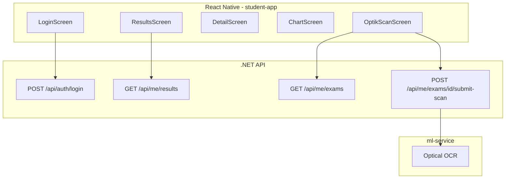
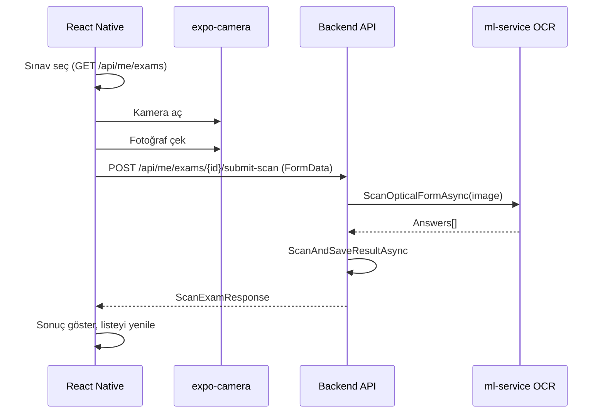

# EduAnalyzer - React Native Öğrenci Mobil Uygulaması Planı

## Genel Bakış

Öğrenci paneli için **React Native (TypeScript)** ile native mobil uygulama geliştirilecek. EduAnalyzer monorepo içinde `student-app/` klasöründe yer alacak. Telefon kamerası ile optik form tarama, mevcut backend OCR API'si kullanılarak yapılacak.

---

## Mimari



---

## 1. Backend Değişiklikleri

Mevcut [ExamsController](backend/src/EduAnalyzer.Api/Controllers/ExamsController.cs) öğretmen odaklı; scan-image `TeacherId` kullanıyor. Öğrencinin kendi optik formunu gönderebilmesi için yeni endpoint'ler gerekli.

### 1.1 GET /api/me/exams

**Amaç:** Öğrencinin cevap verebileceği sınavları listele (henüz sonuç girmemiş, status=ready).

**Mantık:**
- Student.TeacherId == Exam.TeacherId
- Analysis.ClassId == null VEYA Analysis.ClassId == Student.ClassId
- Exam.Status == "ready"
- Öğrencinin bu sınav için ExamResult'ı yok

**Dosya:** [MeController.cs](backend/src/EduAnalyzer.Api/Controllers/MeController.cs) - yeni action

**Servis:** IExamService'e `GetExamsAvailableForStudentAsync(Guid studentId)` ekle.

### 1.2 POST /api/me/exams/{id}/submit-scan

**Amaç:** Öğrenci optik form fotoğrafı gönderir; backend OCR yapar, sonucu kaydeder.

**Request:** FormData (file: image)

**Mantık:**
- StudentId = JWT'den (User.FindFirstValue("StudentId"))
- Exam erişim kontrolü: öğrenci bu sınava erişebilmeli (yukarıdaki kurallar)
- Mevcut IMlClient.ScanOpticalFormAsync + ExamService.ScanAndSaveResultAsync kullan
- TeacherId = Exam.TeacherId

**Dosya:** MeController - yeni action, IFormFile file

---

## 2. React Native Proje Yapısı

```
EduAnalyzer/
├── backend/
├── viewer-app/
├── student-app/           # YENİ
│   ├── src/
│   │   ├── screens/
│   │   │   ├── LoginScreen.tsx
│   │   │   ├── ResultsScreen.tsx
│   │   │   ├── ResultDetailScreen.tsx
│   │   │   ├── WeeklyChartScreen.tsx
│   │   │   └── OptikScanScreen.tsx
│   │   ├── services/
│   │   │   ├── api.ts
│   │   │   └── auth.ts
│   │   ├── navigation/
│   │   ├── components/
│   │   └── types/
│   ├── App.tsx
│   ├── package.json
│   └── tsconfig.json
└── ...
```

**Kurulum:** Expo önerilir (kamera için `expo-camera`):
```bash
npx create-expo-app student-app -t expo-template-blank-typescript
```

---

## 3. Ekranlar ve Özellikler

| Ekran | Açıklama |
|-------|----------|
| LoginScreen | Email/şifre, JWT token saklama (AsyncStorage) |
| ResultsScreen | GET /api/me/results, kart listesi, "Detay" navigasyonu |
| ResultDetailScreen | Tek sonuç: doğru/yanlış, zayıf konular tablosu |
| WeeklyChartScreen | Haftalık gelişim grafiği (react-native-chart-kit veya victory-native) |
| OptikScanScreen | Sınav seç (GET /api/me/exams), kamera, fotoğraf çek, backend'e gönder, sonuç göster |

---

## 4. Telefon Kamerası ile Optik Okuyucu Akışı



**Teknik:**
- **Kamera:** `expo-camera` veya `react-native-vision-camera`
- **Fotoğraf:** `camera.takePictureAsync()` → URI
- **Upload:** `FormData` ile `file` field, `fetch` veya `axios` ile POST
- **Backend:** Mevcut scan-image akışı; sadece student self-submission için yeni endpoint

**API Base URL:** Development'ta Android emulator: `http://10.0.2.2:5131`, iOS simulator: `http://localhost:5131`. Production'da env variable.

---

## 5. Uygulama Sırası

| Sıra | Görev | Tahmini |
|-----|-------|---------|
| 1 | Backend: GET /api/me/exams, POST submit-scan | 2-3 saat |
| 2 | student-app scaffold (Expo + TypeScript) | 1 saat |
| 3 | Auth (login, token storage, api client) | 1-2 saat |
| 4 | ResultsScreen, ResultDetailScreen | 2 saat |
| 5 | WeeklyChartScreen (grafik kütüphanesi) | 1-2 saat |
| 6 | OptikScanScreen (kamera + upload) | 2-3 saat |
| 7 | Navigation (bottom tabs veya stack) | 1 saat |
| 8 | Eksikler raporu güncelle | 0.5 saat |

---

## 6. Dosya Referansları

| Konu | Dosya |
|------|-------|
| Mevcut student results | [MeController.cs](backend/src/EduAnalyzer.Api/Controllers/MeController.cs) |
| Scan logic | [ExamService.cs](backend/src/EduAnalyzer.Application/Services/ExamService.cs), [ExamsController.cs](backend/src/EduAnalyzer.Api/Controllers/ExamsController.cs) |
| Web API client (referans) | [backendApi.ts](viewer-app/src/services/backendApi.ts) |
| Web optik akış | [OpticScan.tsx](viewer-app/src/pages/OpticScan.tsx) |

---

## 7. Web viewer-app

Bu plan **web öğrenci panelini değiştirmez**. viewer-app/student sayfaları aynen kalır. React Native uygulaması ayrı bir ürün; öğrenciler mobilde native app, masaüstünde web kullanabilir.
